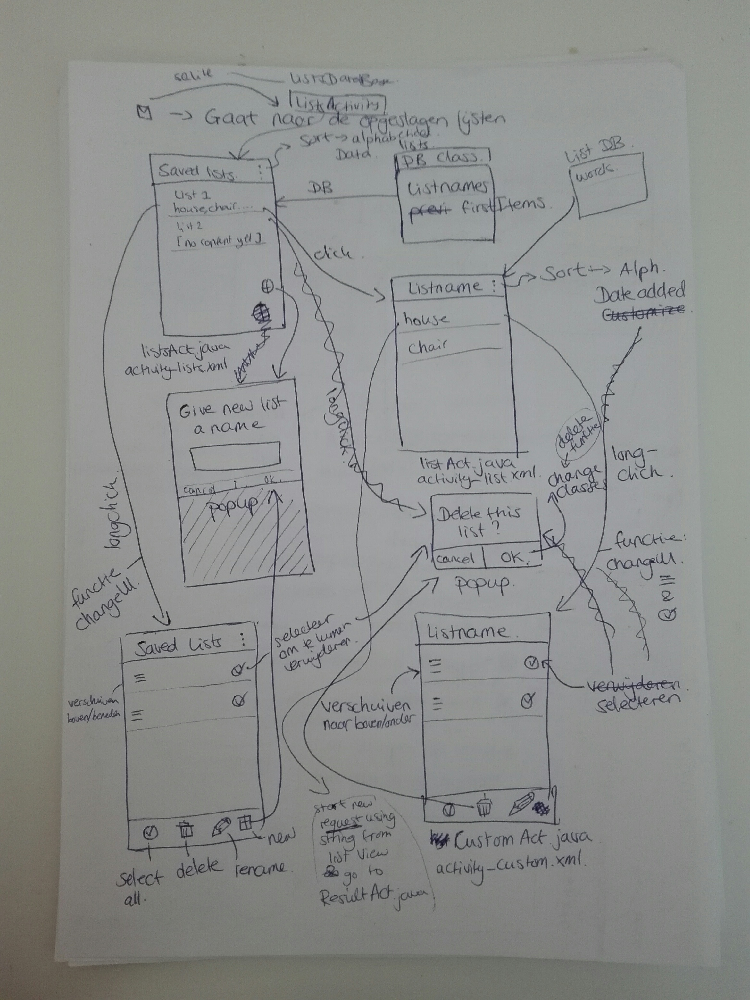
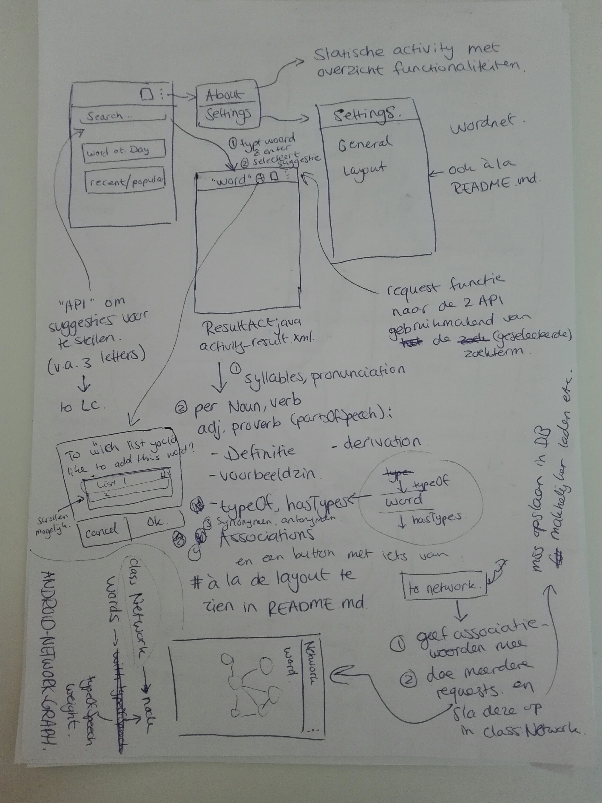

# Design document
Rosan van der Werf <br><br>
Advanced sketches, diagram of utility modules, classes and functions, list of APIs and frameworks or plugins, List of database tables and fields (and their types).

## Advanced sketches of UI
Er kan grofweg een tweedelige scheiding worden gemaakt in de functionaliteiten van de applicatie. De eerste is het zoeken en inzien van woorden. De tweede is het opslaan van woordenlijsten.


\* vanwege opladerproblemen van mijn laptop heb ik maar weinig op de computer kunnen werken. Vandaar dat deze foto's zijn gebruikt voor het weergeven van de sketches. Ik ga deze zsm digitaliseren, maar het kan daarom zijn dat de digitale versie pas later te zien is.

Op de eerste/standaard activiteit, HomeActivity ziet de gebruiker onder andere: een zoekbalk, een item met het woord van de dag, een item met de 10 tien recent opgezochte woorden, een icoon om naar opgeslagen lijsten te gaan, en een icoon om naar About en Settings te gaan. About is een statische activity met informatie over de functionaliteiten van de applicatie.
Met de Settings kan de gebruiker algemene en uiterlijke aspecten veranderen. Bijvoorbeeld welke details worden weergeven bij het opzoeken van een woord, of de grootte van het lettertype.

Wanneer de gebruiker een zoekterm ingevuld heeft, beginnen er twee requests naar de WordsAPI en Word Associations API. Twee functies bestaan om de response(s) te verwerken (een JSONObject response omzetten naar eigenschappen in een class).
Op de nieuwe activiteit (ResultActivity) verschijnen de details van de zoekterm (```syllables, pronunciation, typeOfSpeech, definition, example, derivation, typeOf, hasTypes, synonyms, antonyms, associations```). Het vullen van de views in de ResultActivity wordt gedaan door een functie ```UpdateUI```
Vanuit de ResultActivity kan de gebruiker een netwerk zien van de associaties door op een knop te klikken. De NetworkActivity wordt geopend met daarin een netwerk gemaakt met [android-network-graph](https://github.com/Giwi/android-network-graph).
Er is een Network Class waarin alle associaties van een woord staan, voor al deze associaties en het initiële woord wordt er gekeken waar relaties ontstaan (wanneer het ene woord een associatie is van een ander en/of andersom), inclusief ```typeOfSpeech``` en ```weight```.
Deze twee properties worden ook weergeven met behulp van respectievelijk kleur, en lijndikte.
Vanuit ResultActivity is het ook mogelijk het gezochte woord op te slaan in een lijst. Dit kan door op het + icoon te klikken naast het woord. Wanneer dit gebeurd wordt een functie aangeroepen die een popup op het scherm laat zien. De gebruiker kan aangeven in welke lijst het woord terecht moet komen, en kan dit bevestigen. Het woord, inclusief alle details worden als class instance opgeslagen in de database met de lijsten.
Na de bevestiging wordt een andere UpdateUI functie aangeroepen die een indicatie geeft dat het desbetreffende woord is toegevoegd (er verschijnt wss ook een Toast).

Er is een [] icoon waarmee de gebruiker inzicht krijgt in zijn opgeslagen woordenlijsten. Deze zijn te zien in de ListsActivity, hiervoor is een Lists class en database nodig. Er is een functie die de ```listnames``` en ```firstItems``` uit de database haalt. Deze gegevens worden weergeven in de ListView.
Met een floating action button is het mogelijk om een nieuwe lijst toe te voegen. Er wordt een functie aangeroepen die een popup laat verschijnen waarin de gebruiker een lijstnaam moet geven. Na bevestiging wordt de nieuwe (lege) lijst toegevoegd aan de database.
De items van de ListsActivity kunnen geklikt en 'lang'-geklikt worden. Met een normale klik start een nieuwe activity, de ListActivity, waarin de woorden van de geklikte lijst weergeven worden. Als de gebruiker 'lang'-klikt, dan wordt nog een functie UpdateUI aangeroepen.
het uiterlijk van de ListsActivity veranderd zo dat er mogelijkheden ontstaan om: de volgorde van de lijsten te veranderen, en om lijsten te selecteren. Ook verschijnen er onderaan opties: select all, delete, rename, new list. Al deze acties zijn verbonden aan functies die de samenstellingen van de Lists class veranderen.
Wanneer de gebruiker kiest om een lijst te verwijderen, verschijnt er een popup die vraagt om een bevestiging. Het is vrij zelfsprekend. 
Rechtsboven de ListsActivity zijn drie punten te zien ... die indiceren dat er opties zijn, namelijk het kiezen van een bepaalde volgorde: Alphabetical, Date addded, Customize. Bij Alphabetical en Date added wordt een UpdateUI aangroepen die de volgorden van de ListView veranderd. Met de Customize keuze wordt dezelfde updateUI aangeroepen dan wanneer de gebruiker een longclick doet op een lijstitem.

## Diagram of utility modules, classes and functions




Er zijn 6 classes waarvan er drie subclasses zijn: ```wordDetails``` is een subclass van ```Word```, ```Association``` van ```Association``` en ```List``` van ```Lists```
Deze subclasses dragen bij aan het opslaan van verschillende soorten objecten in de applicatie: woorden, associatie(s/netwerken) en lijsten. Getters en setters worden gebruikt om specifieke data te extraheren voor wanneer bijvoorbeeld de ResultActivity opgevuld worden, of voor wanneer de gebruiker een lijstnaam toevoegd.

Twee database(s/helpers) zijn er om de gegevens omtrent de persoonlijke opgeslagen lijsten te bewaren en extraheren, de ```listsHelper``` en de ```listHelper```. Ook deze database(s/helpers) zijn een soort van verbonden zodat de woorden die bij een bepaalde lijst horen gekoppeld kunnen worden met behulp van een lijstnaam.


## List of APIs and frameworks or plugins 

Voor het opvullen van activities:
* WordsAPI
* Word Associations API


FireBase voor het opslaan van data over de lijsten, maar ook voor het op kunnen slaan van class objecten (zoals een ```wordDetails``` instance met alle details over een woord)

Verder wordt ook het eerdergenoemnde [android-network-graph](https://github.com/Giwi/android-network-graph) gebruikt. Deze 'plugin' helpt bij het maken van netwerken.


No external data sources will be used for this application.

## List of database tables and fields (and their types)
In het diagram zijn twee databases te zien. Deze bevatten allebei een ```id auto increment Integer```, verder bevat de ```listshelper``` een ```listname String```, ```words``` bestaat uit een lijst/array met Strings van de eerste (3 woorden) van de lijst.
```listHelper``` bevat naast een ```id```, ook de ```listname``` van de bijpassende lijst en ```words``` een lijst/array met alle woorden die in die lijst horen.
