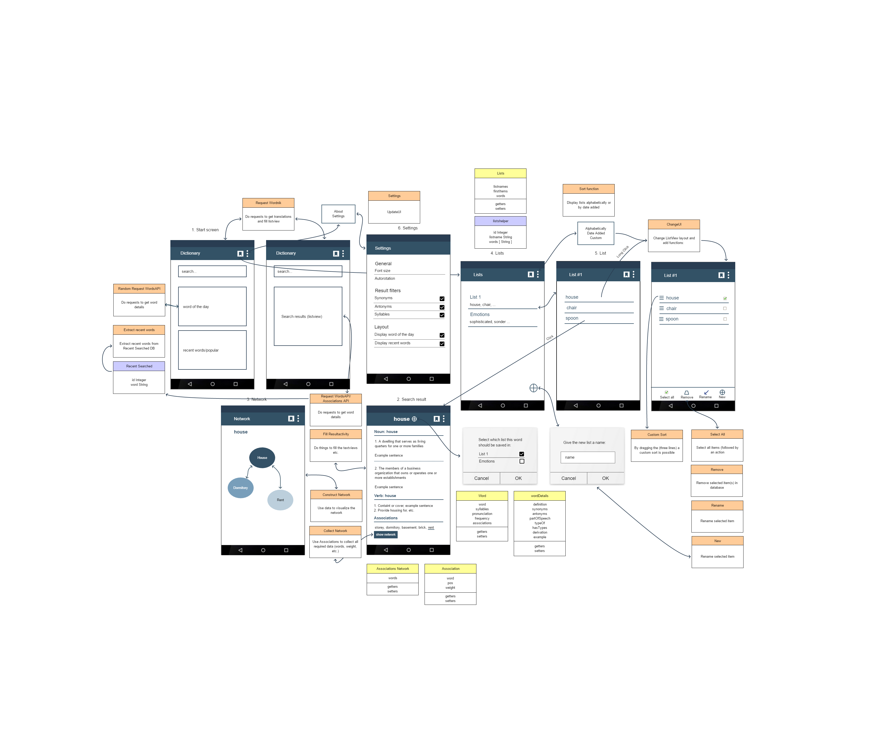

# project
Rosan van der Werf

Short summary: Problem statement, solution, visual sketch, list of main features, prerequisites, data sources, external components, review similar app, hardest parts.

## Problem statement
This application helps users to enrich their vocabulary. There are people that have difficulty communicating in English. This could be because English isn't their first language. The application can be used by people that want to learn and understand the English language by means of a translation and dictionary-like concept and a network visualization. 

## Solution
With the application the user can find definitions, synonyms, antonyms and associations to substantiate and supplement the meaning of a searched word. The associations related to the searched word can be displayed to create a fuller picture. Furthermore, a list can be made to create frequent or interesting words for easy access.

### visual sketch
1. Homescreen
1. (Search)results
1. Network of associations
1. Wordlist
1. Settings/Help/About *

On the Start screen (1) the user sees a search bar, the word of the day, an option to see a random word, and a list of recent or popular words. The user can input a query in the search bar. Using an API possible translations are given. When the user clicks a word, a new activity starts (2). There, all the details of the word are displayed. Per: noun, verb, adjective and proverb the different definitions are given together with example sentences. Also: The syllables and associations. Under the association is a button that says 'show network'. When the user clicks this another activity appears with a network of all the associations (3), and the relation with each other and the initial word. The user can also click the + button to add the word to a specified list. When the 'lists' icon is clicked, the user is send to the lists activity (4). Where it is possible to see the existing list en their contents (5). New lists can be added using the + button. 

### list of main features
Starting from the homescreen:
* Search a word by inputting it in a search bar (and propose suggestions *)
  * Display translations
  * When translation is clicked: display details of the search query
    * Definition, clickable synonyms and antonyms, and possible other characteristics like example sentences (WordsAPI)
    * Give associations of the searched word (Word Associations API)
      * Display associations in a network: this 'algorithm' looks at all the associated words and sees if the initial word is a synonym, antonym or just and association. This is indicated with a color.
        Also, the associations have a (relevance) weight which is used to determine the width of a relation in the network.
    * Add the searched word to the user's personal list, and highlight* important parts
* A link to see personal list(s)
  * Filter: alphabetically, date added, customize
  * Click a word to see details
  * Long click a word to delete it from the list
* Settings
  * Results: which data to be displayed
  * Layout: font size, dark theme

General:
 * Supports rotation of the device

Features marked with * are optional.

## Prerequisites

### Data sources
1. [wordnik](https://www.wordnik.com/)
2. [Word Associations API](https://wordassociations.net/en/api) 

These two APIs are used to generate the results of a search query. The APIs return their requests in JSON, a 'read' function is needed to extract specific data.

### External components
SQLite database(s) are used to store words, lists en listcontents. This is because this way, when the user does not have internet, he is still able to see the saved lists and words. 

### Review of similar app: WordWeb
WordWeb is a Dictionary application, and has a lot in common with this application. It has similar features like searching words, see details about a search query and save a word as bookmark. While searching words, suggestions are made. The details include: a list with defenitions (the word as noun, veb, adjective, etc.) and example sentences, a 'Derived' and 'See also' section. These details are requested and extracted from the response. Bookmarked words are accessible, some sort of database is used to store these words. This appliations will use these methods as well.

### Hardest parts
  * Making the visualization of the associations network with containing visibility and usability
  * Develop the autocomplete/suggestions while searching a word

